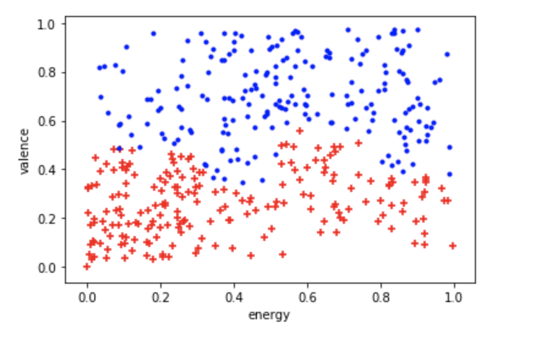
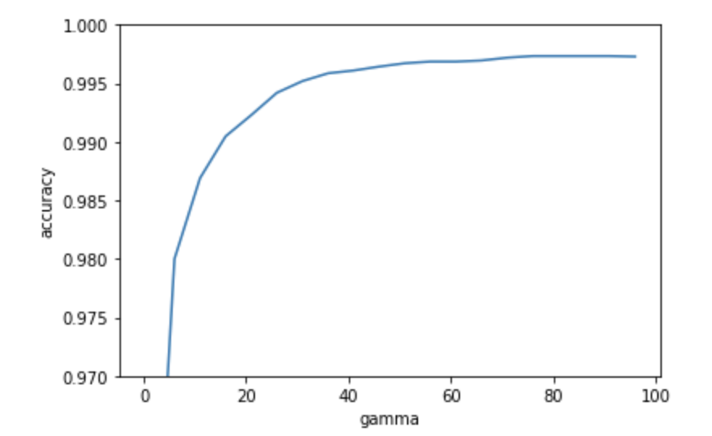
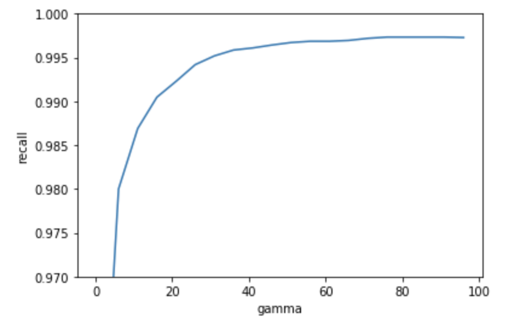
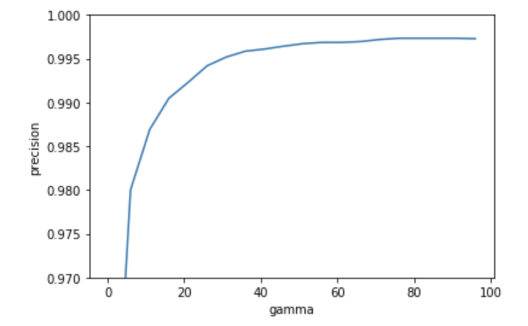
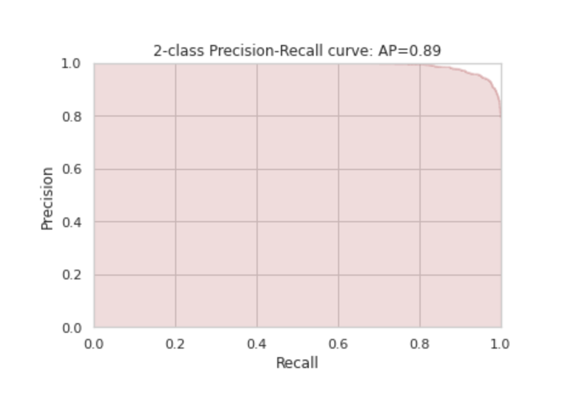
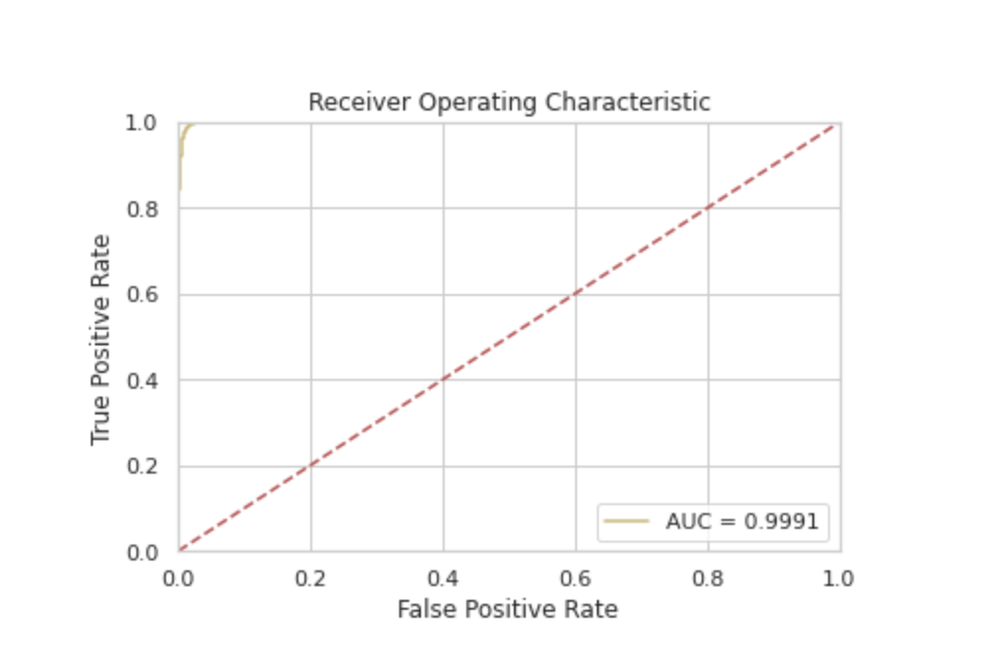

## Introduction
Music drives our lives by setting a narrative tone. From Hollywood productions to a regular Tuesday, music has the power to govern our mindset. Composers and artists have an arsenal of tools to convey their art to their listeners, the most obvious of which are lyrics; however, instrumentals are the unspoken heroes. Our group will look at instrumental features (such as tempo, rhythm, musical key, etc.) to determine relationships between music and human emotions.

## Objective
The project objective is to relate instrumental elements of music with the emotions they convey, providing a breakdown of the emotional composition of a set of music samples. In the past, this is accomplished using lyrics. Instead, we emphasize the importance of instrumental elements in the emotion a musical piece conveys. These elements include timbre, rhythm, melody, valence, arousal, and musical key.

# Touchpoint 2

## Data
We plan to look at the following datasets (and will consider more if needed).
- [Spotify Tracks API](https://developer.spotify.com/documentation/web-api/reference/tracks/get-audio-analysis/)
- [Kaggle 160k Song Dataset](https://www.kaggle.com/yamaerenay/spotify-dataset-19212020-160k-tracks)

What we can expect from these datasets are measures of features of a certain track such as valence (positivity or a song) or arousal (energy of a song). The following is a snippet from Spotify's Track API Audio Analysis tool:

```
{
  "duration_ms" : 255349,
  "key" : 5,
  "mode" : 0,
  "time_signature" : 4,
  "acousticness" : 0.514,
  "danceability" : 0.735,
  "energy" : 0.578,
  "instrumentalness" : 0.0902,
  "liveness" : 0.159,
  "loudness" : -11.840,
  "speechiness" : 0.0461,
  "valence" : 0.624,
  "tempo" : 98.002,
  "id" : "06AKEBrKUckW0KREUWRnvT",
  "uri" : "spotify:track:06AKEBrKUckW0KREUWRnvT",
  "track_href" : "https://api.spotify.com/v1/tracks/06AKEBrKUckW0KREUWRnvT",
  "analysis_url" : "https://api.spotify.com/v1/audio-analysis/06AKEBrKUckW0KREUWRnvT",
  "type" : "audio_features"
}
```
The dataset is a cleaned pull of songs from the Spotify Audio Feature API. Spotify is the second most popular music streaming service in the United States. This dataset is composed of over 160,000 songs and details 14 instrumental features for each record such as key, danceability, energy, and more. Due to musical styles changing with time, records with a creation date from 2000 onwards were included in the final dataset, resulting in 40,000 records.

### Selected Features
We looked through the features and picked out the ones we wanted to use for our exploration. Features like name or year of the song were not chosen for obvious reasons. For other features, such as instrumentalness or speechiness, we read the Spotify API descriptions for and felt wouldn't really contribute much in terms of sentiment, so we decided to leave those out as well. We ended up with the following 8 features:

```
selected_features = [
  "acousticness",
  "danceability",
  "energy",
  "valence",
  "tempo",
  "loudness",
  "key",
  "mode",
]
```

For a full description of what each feature represents, visit the Spotify documentation [here](https://developer.spotify.com/documentation/web-api/reference/tracks/get-audio-features/).

We believe that *key* and *mode* will be crucial as the major/minor key heavily impacts the mood of a song. 

A few concerns arose when selecting our features.

Some features had different ranges. For example, features like energy and valence ranged from 0-1, while tempo and loudness ranged from 0 to 240 and -60 to 0, respectively. We made sure to scale the features to a common range to account for this.

Some features were discrete. For example, mode is a binary value (0 or 1 for minor or major), key is a value from 0-11 (representing each pitch class), and items such as valence are continuous values from 0-1. We decided to try our clustering with these mixed types anyway to see if they would help produce clean clusters.

We also worried that some of the features, such as energy, somewhat overlapped with other features such as loudness and tempo. We decided to include them anyway, as we figured it may help add additional information when transforming the feature space with PCA.

### Plotting Valence vs Energy
The first attempt in finding a relationship between a record's musical elements and its emotional properties was
experimentation with the valence and energy features. Valence describes the musical positivity conveyed by a track.
Tracks with high valence sound more positive, while tracks with low valence sound more negative. Energy represents a
perceptual measure of intensity and activity. Energetic tracks feel fast, loud, and noisy. We sought a relationship between
these features to find a "definition" of what positive and negative songs are. We expected for energy and valence to be
positively correlated, and when plotted against each other, we did see what seemed to be a positive correlation (songs with high valence also had high energy). We returned to this later to do clustering on.

### Performing PCA
With 8 features, our data would have been hard to visualize and analyze, so we decided to try using PCA on our dataset to reduce the number of dimensions while hopefully capturing the important variation within our data. We used 70k datapoints for this. This is a bar graph of the % of variance explained by each principal component, *without scaling the data first*:


We can see an imbalance in variance explained. This is probably due to the fact that tempo, one of the 8 features, ranged from 0-240, while most of the other features ranged from 0-1. The tempo feature's large variance contributes a lot to that first principal component and skews the graph quite a bit.

After we scaled the data, here is what the % of explained variances looked like:


With all of the features on a common scale, the graph looks a bit more balanced. We took the top two principal components when graphing most of the graphs below.

## Unsupervised Algorithm Results
We approached our data from multiple clustering techniques such as K-means, DBScan, and GMM.

### K-Means
We initially attempted to apply K-Means to our data. The results of the elbow method to find the optimal number of clusters is shown below.


We see that the optimal number is between 6-8. From here, we plot the results of k-means clustering and see the following results.


The results are somewhat promising but K-Means is not ideal as there are not any visible circular clusters, thus we decided to attempt DBScan and GMM on the data.

### DBScan
DBScan was also performed to see if it could give us more information compared to previous approaches. The most challenging part of DBScan we encountered was optimizing the eps value and min_components. The results from the clustering are shown below.

Results for all 8 features through PCA, top 2 principal components:<br>

We see two strip-like clusters, probably due to the binary mode feature included. This seemed a little awkward, so we decided to try this with mode (as well as key, another discrete-valued feature) removed.

Results without key and mode, leaving 6 features put through PCA, top 2 principal components:<br>


We also decided to use only valence and energy:<br>

(seems to be tilted since we forgot to remove PCA from this one)

We didn't get any satisfactory results, so we decided to try GMM.

### GMM
Songs can convey a mix of emotions, so we decided to try a soft-clustering approach to our problem with GMM. Here, we arbitrarily decided to use 12 cluster centers, each one corresponding to one emotion on the emotion circle shown in the results and conclusion section.

Results for all 8 features through PCA, top 2 principal components:<br>


We see the same two-strip separation. The 12 separate clusters are likely separated by key (0-11). These clusters are believable but we felt that those features would make our classification too reliant on mode and key. We wanted to see what our clusters would look like without key and mode.


This looks a lot better but we approach GMM again but only looking at **energy vs valence**. The results are very promising because they coincide with expected results and allow us to label our clusters. The results are shown below. 


**Note*: For the clustering graphs above for GMM, they are purely for helping visualize emerging clusters after performing GMM. Since GMM is a soft clustering algorithm, the probability distribution looks something like this for one of the datapoints. 

|  Cluster ID |    0    |     1    |    2    |   3   |     4    |    5    |  6  |   7   |   8  |     9    |    10   |   11   |
|:-----------:|:-------:|:--------:|:-------:|:-----:|:--------:|:-------:|:---:|:-----:|:----:|:--------:|:-------:|:------:|
| Probability | 3.66e-5 | 1.53e-10 | 0.00334 | 0.059 | 2.36e-17 | 2.26e-8 | 0.2 | 0.052 | 0.68 | 5.18e-13 | 1.45e-7 | 0.0078 |

This information is valuable to us because we believe songs can exemplify muliple emotions and it would make sense that one song could pertain to mutliple clusters.

## Unsupervised Learning Results and Conclusion
GMM seems to provide the most promising clustering (especially energy vs valence) and would allow us to assign clusters to the following emotion circle.


We generated csv files corresponding to each cluster to verify any differences and assist in labeling. You can listen to examples of such below to see differences in musical emotion.


### Music Cluster Snippets
The following clips are used for educational purposes. The following links will correspond to snippets of music from songs found in respective clusters on Google drive.

[Cluster 0 Song Clip](https://drive.google.com/file/d/17mtqN4uOsIIy5JJNEc4943LtqLBx-DgY/view?usp=sharing)

[Cluster 2 Song Clip](https://drive.google.com/file/d/1mLX2YiOUhb-GoJeijT-tsb-nq0JlQP6e/view?usp=sharing)

[Cluster 4 Song Clip](https://drive.google.com/file/d/13Tnl24dhBc-84y9RafF0DeNfhRGfBF6m/view?usp=sharing)

[Cluster 6 Song Clip](https://drive.google.com/file/d/1Rye5-_d4DlLFIFBBp43qqlGRy2FqwJIC/view?usp=sharing)

[Cluster 8 Song Clip](https://drive.google.com/file/d/1vnPJs-GrFQh28fpdZ5_xV0NWWRE0xBr9/view?usp=sharing)

[Cluster 10 Song Clip0](https://drive.google.com/file/d/1yODw4yaGGe29XYh9CVfDcEE6zGCkMcit/view?usp=sharing)


### Discussion - Unsupervised
The results are promising as when listening to the music clips, we observe distinct differences in moods (subjectively) as a team. It is interesting to note that when looking at simply energy and valence plotted without clustering...


We see density along the positive diagonal noting that songs tend to match their levels and not too many songs are created with unique profiles as outliers. From here, we will label our clusters with a general emotion which will assist in our supervised learning portion.

## Supervised Learning Results
The unsupervised portion of our project will play an important role in determining labels for our supervised algorithm. We initially planned on using just KNN Classification to determine what emotions an unknown song conveys, but we have expanded to other techniques such as Decision Trees, Random Forests, and SVM Classification.

With our unsupervised results, we can set a ground truth for our dataset. Our plan will be to run our GMM model on the whole dataset and train our Supervised model on half of this dataset. We will use the other half as testing data and since we have labels for the entire dataset, we can easily confirm our results.

### SVM
The first classification we tried looking into was simply if we could differentiate **negative** and **positive** feeling songs. To start, we again only looked at *energy vs valence*. To determine our two classes, we labeled our clusters from our unsupervised learning algorithm based on their energy and valence values, referring to the emotion circle, as well as listening to songs in each class.

We decided to train on 70% of our data and use the remaining 30% to test. The datapoints for each respective class is plotted below.



As we can see, the data is only slightly linearly separable. Thus **RBF** was selected as the kernal. We started of with a gamma of 0.1 an noticed that as we increased the gamma, the better the scores became. Below are the plots for accuracy, recall, and precision with respect to gamma values. 

Accuracy vs. Gamma


Recall vs. Gamma


Precision vs. Gamma


We want to penalize misclassification as if we were to utilize this as a tool, we don't want to mix in a negative sounding song into a positive playlist especially if there are overwelming positive attributed songs.

Thus we ultimately settled on a gamma of around 35 as the performance plateaus after that.

With SVM we were able to classify songs as positive or negative with great efficacy but the example is somewhat simple when looking at purely energy vs valence. Thus we continued to explore other options.

### Class Distribution
For our remaining supervised learning algorithms, our class distrubtion is as follows.

| Class       | Excited | Gentle | Happy | Jazz-adjacent | Mellow | Peaceful | Relaxed | Rhythmic | Sad   | Slick | Tender | Upbeat |
|-------------|---------|--------|-------|---------------|--------|----------|---------|----------|-------|-------|--------|--------|
| Distrubtion | 0.11    | 0.052  | 0.045 | 0.112         | 0.104  | 0.092    | 0.081   | 0.059    | 0.042 | 0.096 | 0.087  | 0.12   |

### KNN Classification

### Decision Trees
Decision trees were one of the classifiers we tried. The feeling of a song can depend on many different factors that may not be linearly separable, so we decided that a decision tree's branching nature would be a good fit to model that.

For example, while sad songs are generally of low valence and low energy, a peaceful song may be more complex -- it could have low energy which lends it its soothing nature, but could potentially have a wider range of valence, perhaps from mid to high valence. Other types of songs could have more complicated relationships between these and the other 6 features we chose. We felt that the way a decision tree splits each feature into ranges through branching paths could "suss out" these relationships.

Decision trees are also nice in visualizations, and seeing which features are split and where provide interesting insights into the data. For a decision tree this complex, it can be a bit unwieldy, but interesting nonetheless.

#### Visualization
Visualization of the entire tree is quite hard with 12 layers. The best we could manage and have it still be somewhat readable is truncating the visualization to 6 layers -- any more and the leaf nodes bunch up more than they already are. The resulting image is quite wide:

[Decision Tree Visual (too large to fit on page)](https://drive.google.com/file/d/17vg-ZgkKr3dTBIGE92IhQWoJ5n8kRN-A/view?usp=sharing)

Each node is color coded by its majority class, and we can see the bands of color form as the data points are split. If you take a look at the svg, you can see more clearly the attributes that the tree is splitting on. The first attribute to be split is mode, which makes sense given that it is either 1 or a 0, and our unsupervised portion of the project split the dataset into two distinct clusters based on this.

The very next split is on acousticness, which was interesting to see as one might expect the energy or valence (general positivity) of a song to matter more. Acousticness measures the prevalence of acoustic instruments in the song over electric instruments and sounds. With that in mind, it does make sense that acousticness would play a role in the general feeling of a song -- more tender, emotional songs may opt for acoustic instruments over electronic instruments (but not always!)

Further down the tree, we see splits on attributes such as energy, valence, and danceability, as well as more splits on acousticness.

#### Results
We ran our decision tree with a max layer of 12 and used entropy to split. We started with 7 layers and increased the number from there to see how our accuracy would be affected:

7 layers: ~80.9%
9 layers: ~84.6%
12 layers: ~87.3%
15 layers: ~87.9%

We see decent increases in accuracy up until 15 layers. We decided to stick with 12 layers since the increase in accuracy from there was miniscule, and 15 layers took quite a while to run.

With 12 layers, the resulting overall accuracy was ~87.3%, which is better than our baseline guess performance of ~12%. Here are the scores for precision and recall for each class:


| Class         | Precision | Recall |
|---------------|-----------|--------|
| excited       | 0.862     | 0.868  |
| gentle        | 0.782     | 0.871  |
| happy         | 0.847     | 0.842  |
| jazz-adjacent | 0.856     | 0.980  |
| mellow        | 0.978     | 0.875  |
| peaceful      | 0.853     | 0.850  |
| relaxed       | 0.844     | 0.836  |
| rhythmic      | 0.874     | 0.825  |
| sad           | 0.807     | 0.994  |
| slick         | 0.997     | 0.870  |
| tender        | 0.839     | 0.851  |
| upbeat        | 0.875     | 0.830  |

The class "slick" has the highest precision, while the class "sad" has the highest recall. Precision of a class measures the proportion of elements correctly predicted to be that class out of all of the data points that were predicted to be that class, or (true positives / true positives + false positives). It seems like the decision tree is better at finding all of the songs labeled "slick" in the dataset than the other classes. The recall for "slick" isn't the lowest, but it's also not the 

### Random Forests
Because of the promising results from our Decision Tree implementation, we decided to try out Random Forests as well. The data used was similar as before with scaled features (which ultimately did not change much of the metrics). For random forests, the features used again were as following...
  - "acousticness", 
  - "danceability",
  - "energy",
  - "valence",
  - "tempo",
  - "loudness",
  - "key",
  - "mode"

The calculated entropy and information gain was used as the criteria to evaluate our splits for our estimators. Various amounts of estimators were attemped. In our findings, we noticed that increasing our count to more than 50 estimators would only marginally improve our metrics. (accuracy, precision, and recall) For example, increasing from 50 to 100 estimators resulted in only a 2% increase in accuracy.

The following links are our random forest results with different estimators. The images are again too large to be shown here.

[Random Forest Estimator-0](https://drive.google.com/file/d/1THbwrmBtIOLhFSfp0IhYGf34OWzEd0w-/view?usp=sharing)

[Random Forest Estimator-1](https://drive.google.com/file/d/1CSJQ69toj84heezK54bkiSXpgfCaTYZy/view?usp=sharing)

[Random Forest Estimator-5](https://drive.google.com/file/d/1N5U_heqS6tm4c0YwvmKh1Mt6QdqE_E0c/view?usp=sharing)

Our **max depth** value of our estimators was set to 8 to utilize the number of individuals rather than the number of layers of each estimator. This achieved an accuracy of 88%. Ultimately, increasing the number of estimators improved our accuracy. The maximum accuracy that was achieved was 94% with a **max depth** of 20. The following chart shows our evaluation results.



Characteristic Results


The results for each cluster can be visualized with the following table.

|  Cluster Name  | Precision | Recall | F1-Score | Support |
|:--------------:|:---------:|:------:|:--------:|:-------:|
| Jazz- Adjacent |    0.88   |  0.92  |   0.90   |   1654  |
|     Mellow     |    0.95   |  0.92  |   0.93   |   1600  |
|      Happy     |    0.89   |  0.88  |   0.89   |   680   |
|      Slick     |    0.94   |  0.98  |   0.96   |   1480  |
|     Relaxed    |    0.88   |  0.84  |   0.86   |   1254  |
|       Sad      |    0.95   |  0.91  |   0.93   |   615   |
|     Upbeat     |   0.849   |  0.847 |   0.848  |   1831  |
|     Excited    |   0.849   |  0.897 |   0.873  |   1676  |
|     Tender     |   0.863   |  0.852 |   0.858  |   1375  |
|     Gentle     |   0.903   |  0.846 |   0.873  |   813   |
|    Peaceful    |   0.866   |  0.844 |   0.855  |   1393  |
|    Rhythmic    |   0.912   |  0.926 |   0.919  |   921   |

Overall our results for random forest didn't give us more insight as the performace was comparable to decision trees with more estimators and less depth.

### Discussion - Supervised

# Touchpoint 1 Items
The items below are for touchpoint 1, some may still be applicable but the content above reports on the midterm progress

## Planned Methods and Algorithms
We plan on using both unsupervised and supervised algorithms to reveal the relationship between songs and emotions.
### Unsupervised - GMM Clustering
GMM Clustering will be used on datasets to cluster closely related emotional activations of songs. We will start out with general properties such as "happy" or "sad" but will expand out clusters to encapsulate more emotions.

### Supervised - KNN Classification
The unsupervised portion of our project will play an important role in determining labels for our supervised algorithm. We plan on using KNN Classification to determine what emotions an unknown song conveys.

## Expected Results
The goal of our project is to be able to accurately associate songs to certain emotions that span multiple levels of intensity from calming to exciting, sleepy to energetic, and positive to negative. This will help confirm correlations we see between musical features and emotions, such as minor key songs being generally more negative and high rhythm songs as more energetic. We also hope to see if performing sentiment analysis on instrumental features are more accurate than performing lyrical analysis.

## Discussion
The best outcome is having a model that is able to measure levels of emotions given a certain song or playlist. We can then use our model to evaluate how accurate current music streaming platform playlists are. For example, Spotify and Apple Music both have pregenerated platform playlists for workouts and studying. We could evaluate how successful these platforms are at creating their playlists and potentially suggest removal/additions to increase a playlist's performance. Our tool could also be utilized to analyze personal/community generated playlist.

Our applications could stretch far beyond just songs. We could apply our model to films by looking at the effectiveness of the background music of a scene in invoking a certain emotion. Marketers could use such a model to determine what song/tracks should be used in trailers or product commercials.

Currently our project only looks at the instrumentals but for the next steps in creating a more effective model would include incorporating lyrical analysis. This could help enhance our results and also account for our "musical sarcasm" problem of positive instrumentals with negative lyrics.

## References
- [Machine Recognition of Music Emotion: A Review](https://www.researchgate.net/publication/254004106_Machine_Recognition_of_Music_Emotion_A_Review)
- [Applying Data Mining for Sentiment Analysis in Music](https://www.researchgate.net/publication/318510880_Applying_Data_Mining_for_Sentiment_Analysis_in_Music)
- [Modeling Music Emotion Judgments Using Machine Learning Methods](https://www.frontiersin.org/articles/10.3389/fpsyg.2017.02239/full)
