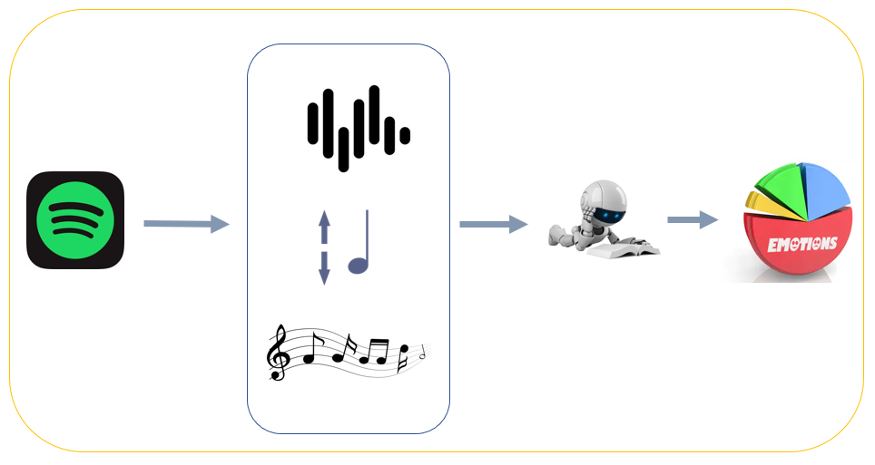
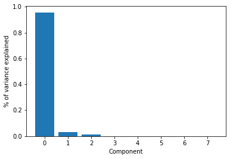
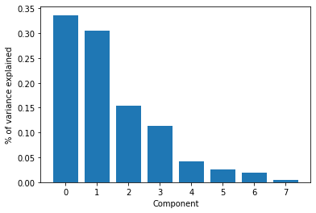
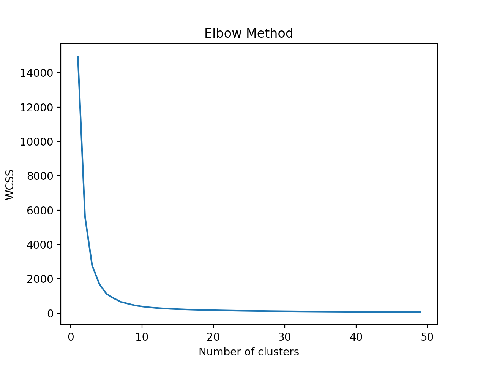
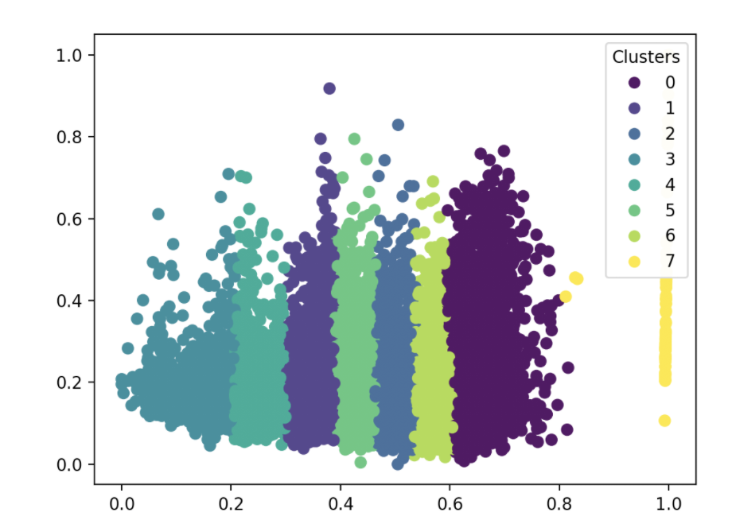
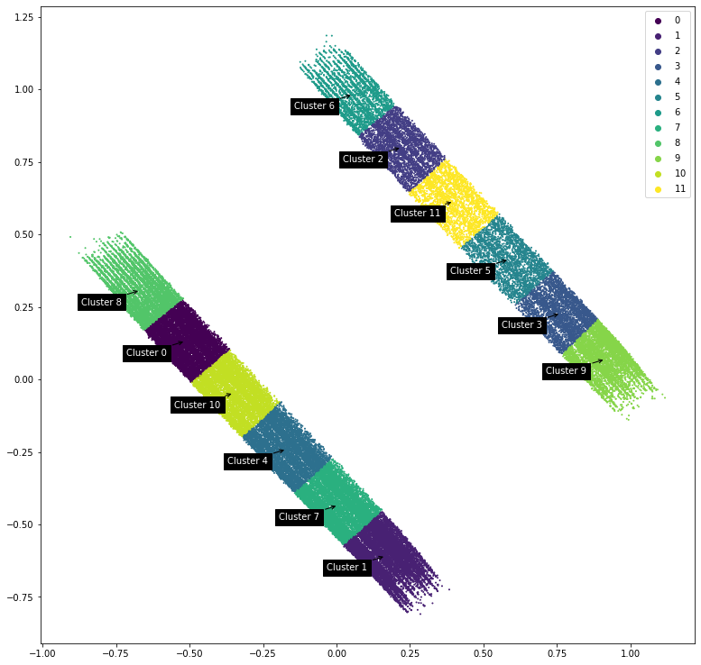
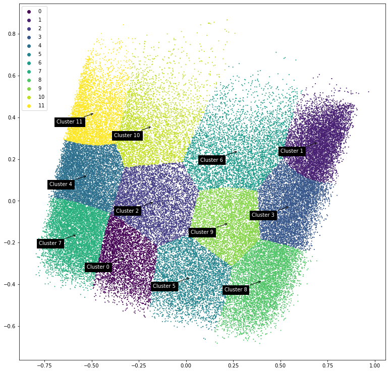
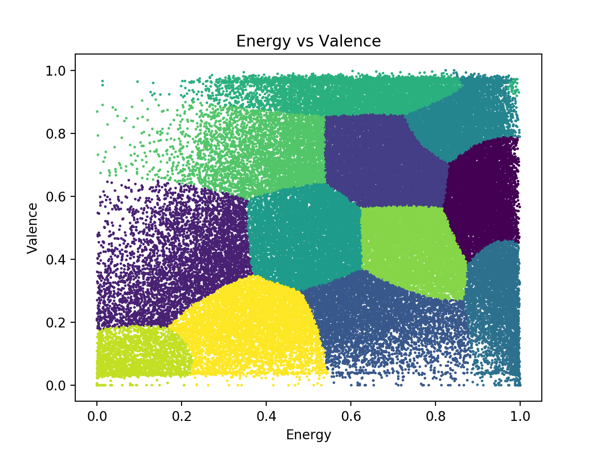
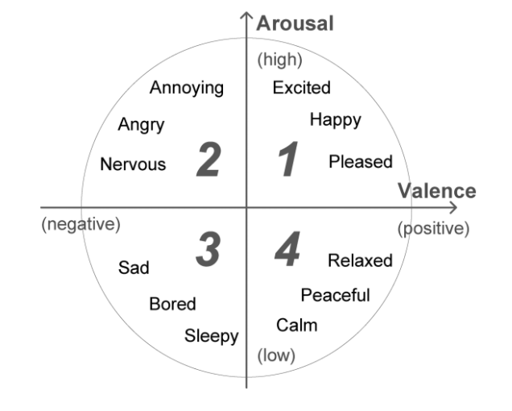

## Introduction
Music drives our lives by setting a narrative tone. From Hollywood productions to a regular Tuesday, music has the power to govern our mindset. Composers and artists have an arsenal of tools to convey their art to their listeners, the most obvious of which are lyrics; however, instrumentals are the unspoken heroes. Our group will look at instrumental features (such as tempo, rhythm, musical key, etc.) to determine relationships between music and human emotions.

## Data
We plan to look at the following datasets (and will consider more if needed).
- [Spotify Tracks API](https://developer.spotify.com/documentation/web-api/reference/tracks/get-audio-analysis/)
- [Kaggle 160k Song Dataset](https://www.kaggle.com/yamaerenay/spotify-dataset-19212020-160k-tracks)

What we can expect from these datasets are measures of features of a certain track such as valence (positivity or a song) or arousal (energy of a song). The following is a snippet from Spotify's Track API Audio Analysis tool:

```
{
  "duration_ms" : 255349,
  "key" : 5,
  "mode" : 0,
  "time_signature" : 4,
  "acousticness" : 0.514,
  "danceability" : 0.735,
  "energy" : 0.578,
  "instrumentalness" : 0.0902,
  "liveness" : 0.159,
  "loudness" : -11.840,
  "speechiness" : 0.0461,
  "valence" : 0.624,
  "tempo" : 98.002,
  "id" : "06AKEBrKUckW0KREUWRnvT",
  "uri" : "spotify:track:06AKEBrKUckW0KREUWRnvT",
  "track_href" : "https://api.spotify.com/v1/tracks/06AKEBrKUckW0KREUWRnvT",
  "analysis_url" : "https://api.spotify.com/v1/audio-analysis/06AKEBrKUckW0KREUWRnvT",
  "type" : "audio_features"
}
```
The employed dataset is a cleaned pull from the Spotify API. Spotify is the second most popular music streaming service in the United States. This dataset is composed of over 160,000 songs and details 14 instrumental features for each record. Of the 14, we will include 9 in our study. The features are as follows : Key, Acousticcness, Danceability, Energy, Instrumentalness,Loudness, Speachiness, Valence, and Tempo. Due to musical styles changing with time, records with a creation date from 2000 onwards were included in the final dataset, resulting in 40,000 records.

### Selected Features
We will consider only the following features as song features (such as artist/year) will be irrelevant to the analysis based on musical features.

```
selected_features = [
  "acousticness",
  "danceability",
  "energy",
  "valence",
  "tempo",
  "loudness",
  "key",
  "mode",
]
```

For a full descrption of what each feature represents, visit the Spotify documentation [here](https://developer.spotify.com/documentation/web-api/reference/tracks/get-audio-features/).

We believe that *key* and *mode* will be crucial as the major/minor key heavily impacts the mood of a song. 

Some concerns arise when selecting our features however. For example, mode is a binar value, key is a value from 0-14, and items such as valence are 0-1 continuously. We also worry that some of the meausre, such as energy, are generated from other features such as loudness and tempo. However, this shold be handled by performing PCA.

### Valence vs Energy
The first attempt in finding a relationship between a record's musical elements and its emotional properties was
experimentation with the valence and energy features. Valence describes the musical positiveness conveyed by a track.
Tracks with high valence sound more positive, while tracks with low valence sound more negative.Energy represents a
perceptual measure of intensity and activity. Energetic tracks feel fast, loud, and noisy. We sought a relationship between
these features to find a "definition" of what positive and negative songs are. We expected for arousal and valence to be
positively correlated. When plotted against each other, there did not noticeable clusters were not present. However, there
seems to be density present along the positive diagonal, i.e. most songs seem to match their valence and energy levels.

### Performing PCA
Before performing PCA, the variances plotted across the dataset is represented by the following chart. 



After PCA was performing on 2 primary components, the variances are as such.



## Unsupervised Algorithm Results
We approached our data from multiple clustering techniques such as K-means, DBScan, and GMM.

### K-Means
We initially attempted to apply K-Means to our data. The results of the elbow method to find the optimal number of clusters is shown below.



We see that the optimal number is between 6-8. From here, we plot the results of k-means clustering and see the following results.



The results are somewhat promising but we decided to attempt GMM on the data.

### GMM
Songs can convery multiple emotions and thus it was logical to apply soft-clustering to our problem. When applying GMM on our initial set of features, we see the following results.



As we can see, there is a very obvious separation (presumable mode) and potentially the subsections are split by key (0-14). These clusters are believable but we felt that key and mode biased the data too strongly and thus we attempted GMM again without key and mode. The results are show below.



This looks a lot better but we approach GMM again but only looking at **energy vs valence**. The results are very promising because they coincide with expected results and allow us to label our clusters. The results is show below. 



### DBScan
DBScan was also performed to see if it could give us more information compared to previous approaches. 

WIP

### Unsupervised Conclusion
GMM seems to provide the most promising clustering (especially energy vs vaence) and would allow us to assign clusters to the following emotion circle.



We generated csv files cooresponding to each cluster to verify any differences and assist in labeling. You can listen to examples of such below to see differences in musical emotion.


# Touchpoint 1 Items
The items below are for touchpoint 1, some may still be applicable but the content above reports on the midterm progress

## Planned Methods and Algorithms
We plan on using both unsupervised and supervised algorithms to reveal the relationship between songs and emotions.
### Unsupervised - GMM Clustering
GMM Clustering will be used on datasets to cluster closely related emotional activations of songs. We will start out with general properties such as "happy" or "sad" but will expand out clusters to encapsulate more emotions.

### Supervised - KNN Classification
The unsupervised portion of our project will play an important role in determining labels for our supervised algorithm. We plan on using KNN Classification to determine what emotions an unknown song conveys.

## Expected Results
The goal of our project is to be able to accurately associate songs to certain emotions that span multiple levels of intensity from calming to exciting, sleepy to energetic, and positive to negative. This will help confirm correlations we see between musical features and emotions, such as minor key songs being generally more negative and high rhythm songs as more energetic. We also hope to see if performing sentiment analysis on instrumental features are more accurate than performing lyrical analysis.

## Discussion
The best outcome is having a model that is able to measure levels of emotions given a certain song or playlist. We can then use our model to evaluate how accurate current music streaming platform playlists are. For example, Spotify and Apple Music both have pregenerated platform playlists for workouts and studying. We could evaluate how successful these platforms are at creating their playlists and potentially suggest removal/additions to increase a playlist's performance. Our tool could also be utlizied to analyze personal/community generated playlist.

Our applications could stretch far beyond just songs. We could apply our model to films by looking at the effectiveness of the background music of a scene in invoking a certain emotion. Marketers could use such a model to determine what song/tracks should be used in trailers or product commercials.

Currently our project only looks at the instrumentals but for the next steps in creating a more effective model would include incorporating lyrical analysis. This could help enhance our results and also account for our "musical sarcasm" problem of positive instrumentals with negative lyrics.

## References
- [Machine Recognition of Music Emotion: A Review](https://www.researchgate.net/publication/254004106_Machine_Recognition_of_Music_Emotion_A_Review)
- [Applying Data Mining for Sentiment Analysis in Music](https://www.researchgate.net/publication/318510880_Applying_Data_Mining_for_Sentiment_Analysis_in_Music)
- [Modeling Music Emotion Judgments Using Machine Learning Methods](https://www.frontiersin.org/articles/10.3389/fpsyg.2017.02239/full)
